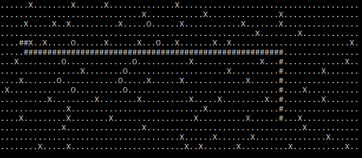

# dijkstra
Path finding algorithm implementation

##
Program gets an ascii file as argument. The file contains 2 coordinates (x, y) and a map. The map contains trees (marked as X), rocks (marked as O) and free surface (marked with .). One cannot traverse through rocks or trees, only through the free terrain. Only horizontal and vertical movement is possible. The picture below is an example of the input file content.


The PathFinder program takes the file as argument and finds the shortest path through the map from start point to end point, and calculate how many trees (X) were passed on the way. The program used Dijkstra's algorithm. For the example file above, the result is 9, and the path is shown below. The actual path is not returned to the user.



## Instructions
* Download the repository to your computer.
* Make sure that dotnet 7.0 sdk and runtime are installed to your computer.

```console
foo@bar:~/dijkstra$ pwd
/home/foo/dijkstra
foo@bar:~/dijkstra$ cd PathFinder
foo@bar:~/dijkstra/PathFinder$ dotnet build
foo@bar:~/dijkstra/PathFinder$ cd bin/Debug/net7.0/
foo@bar:~/dijkstra/PathFinder/bin/Debug/net7.0$ ./PathFinder <map_file> 
```

## Map file limitations
* first row should contain starting point coordinate (must be inside map area)
* second row should contain end point coordinate (must be inside map area)
* the following lines should contain area of the map ('X', 'O', '.')
* make sure that the map file does not contain any empty lines
